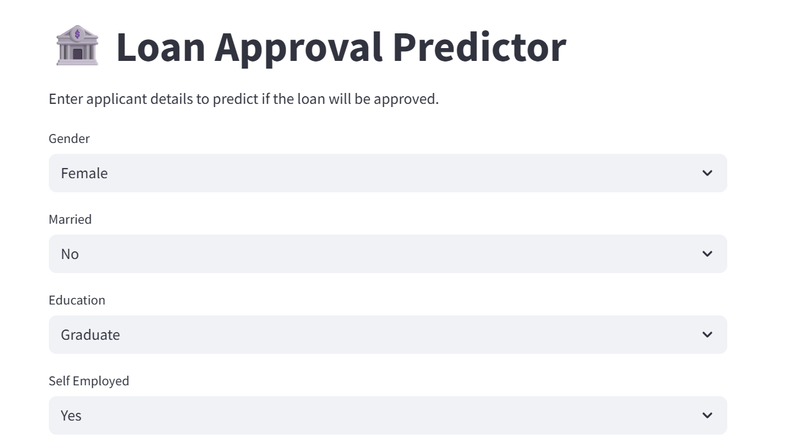
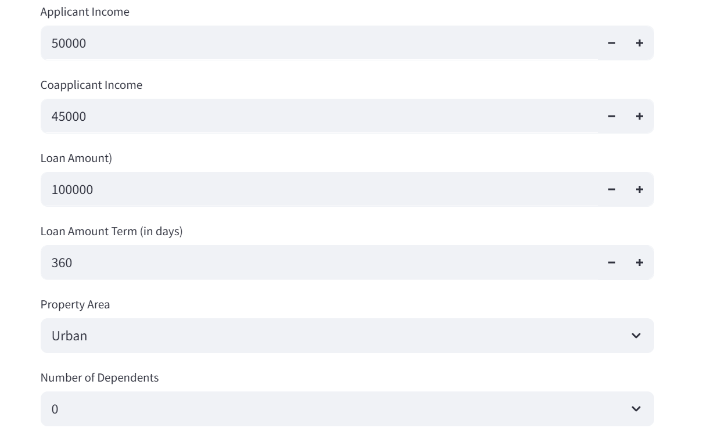
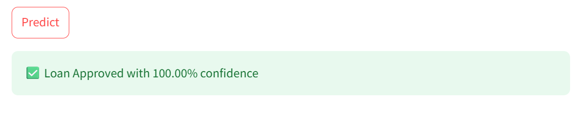

# Loan Approval Predictor

This is a Streamlit web app that predicts whether a loan will be approved based on applicant details using a Decision Tree Classifier.

---
## App Preview

## Features

- Input applicant details like Gender, Marital Status, Income, Loan Amount, Loan Term (in days), Credit History, Property Area, and Dependents.
- Predicts loan approval status (`Approved` or `Not Approved`).
- Interactive and user-friendly interface built with Streamlit.

---

## Dataset

The model is trained on a loan dataset (`loan predictor.csv`) containing features such as:

- Loan_ID (removed during processing)
- Gender
- Married
- Dependents
- Education
- Self_Employed
- ApplicantIncome
- CoapplicantIncome
- LoanAmount
- Loan_Amount_Term (in days)
- Property_Area

---

## How to Run

1. Clone this repository:
  https://github.com/Surbhirikhari/Loan_predition/tree/main

2. Run the Streamlit app:
   streamlit run app.py

   
